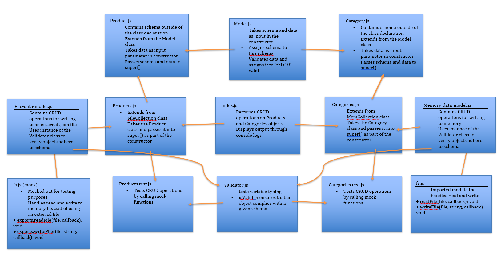

# LAB: Data Modeling (04)

## Creating Models that CRUD!

### Author: Earl Jay Caoile

### Links and Resources
* [submission PR](https://github.com/js-401n15-eoc/lab-04/pull/1)
* [GitHub Actions](https://github.com/js-401n15-eoc/lab-04/actions)

#### Documentation
* [MDN docs (Details of the object model
)](https://developer.mozilla.org/en-US/docs/Web/JavaScript/Guide/Details_of_the_Object_Model)

### Setup
#### Tests
* Testing command: `npm test` from root directory

#### UML
